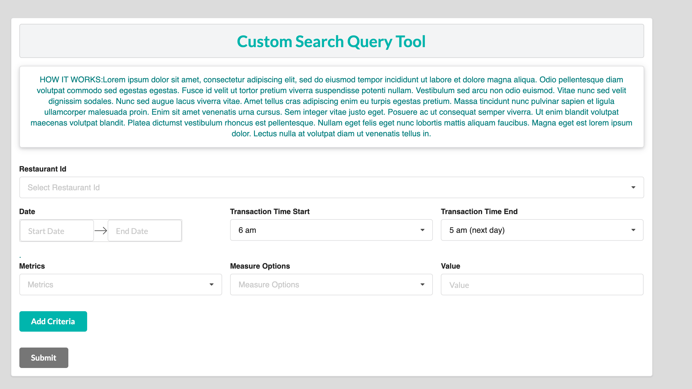
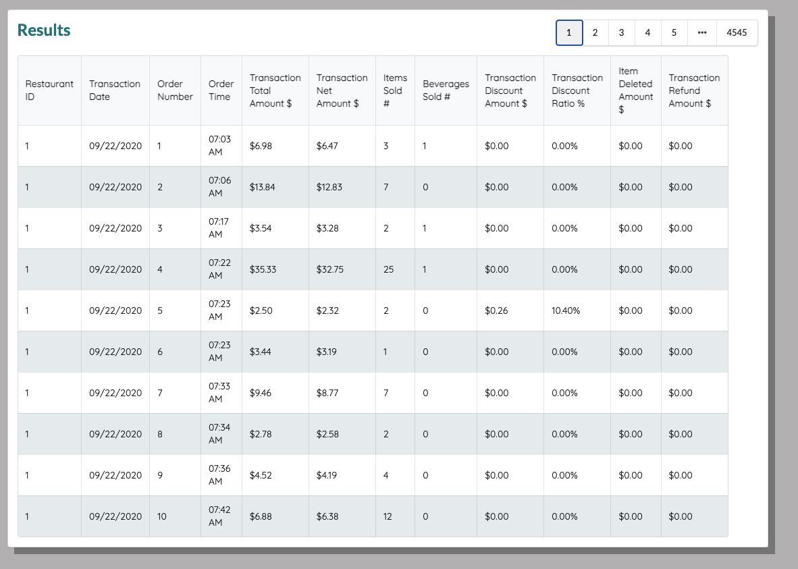

<div id="top"></div>

<!-- PROJECT LOGO -->
<br />

<!-- TABLE OF CONTENTS -->
<details>
  <summary>Table of Contents</summary>
  <ol>
    <li>
      <a href="#about-the-project">About The Project</a>
      <ul>
        <li><a href="#built-with">Built With</a></li>
      </ul>
    </li>
    <li>
      <a href="#getting-started">Getting Started</a>
      <ul>
        <li><a href="#prerequisites">Prerequisites</a></li>
        <li><a href="#installation">Installation</a></li>
      </ul>
    </li>
    <li><a href="#usage">Usage</a></li>
    <li><a href="#roadmap">Roadmap</a></li>
    <li><a href="#contributing">Contributing</a></li>
    <li><a href="#license">License</a></li>
    <li><a href="#contact">Contact</a></li>
    <li><a href="#acknowledgments">Acknowledgments</a></li>
  </ol>
</details>


<!-- ABOUT THE PROJECT -->
## About The Project
* A web user interface through which users can submit search queries for a given restaurant data. The app is written in React (JavaScript).There is a set of controls through which the user inputs the search parameters.



<u> The set of inputs are following: </u>
1.  RestaurantId selector (List of Ids from 1-10)
2.  Date range picker (Some sort of calendar input for a date range)
3.  Transaction time picker (The default should be between 6am to 5am next day with the option to change it in hourly increments)
4.  Metric selector
-  User is able to pick a metric from a given list
-  Then select a measure (<=, <, =, >, >=)
-  And compare it to a numerical value
The format of the restaurant data is the following:




<p align="right">(<a href="#top">back to top</a>)</p>


### Built With


* [React.js](https://reactjs.org/)
* [Semantic UI React](https://react.semantic-ui.com/)
* [react-dates](https://www.npmjs.com/package/react-dates)


<p align="right">(<a href="#top">back to top</a>)</p>


<!-- GETTING STARTED -->
## Getting Started

### Installation
To get a local copy up and running follow these simple example steps.
1. Clone the repo
   ```sh
   git clone https://github.com/your_username_/Project-Name.git
   ```
2. Install NPM packages
   ```sh
   npm install
   ```

### Prerequisites


* npm
  ```sh
  npm install npm@latest -g
  ```


## Contact

Ursala Lindsey - [@linkedIn](https://www.linkedin.com/in/ursala-lindsey) 
Project Link: [https://github.com/danyll39/react-custom-search-query](https://github.com/danyll39/react-custom-search-query)

<p align="right">(<a href="#top">back to top</a>)</p>


<!-- ACKNOWLEDGMENTS -->
## Acknowledgments


* [Google Fonts](https://fonts.google.com/)
* [Azure](https://azure.microsoft.com/en-us/)
* [othneildrew](https://github.com/othneildrew/Best-README-Template)


<p align="right">(<a href="#top">back to top</a>)</p>


